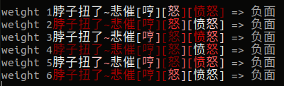
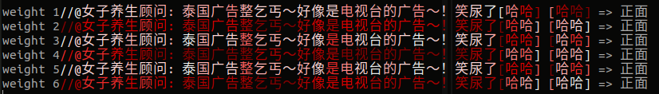
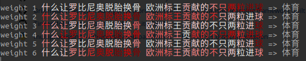

# text-signification-in-rnn

探索LSTM网络中，每个time steps输入的重要性。根据自回归的特点，这里设计了几种比较直观的输入权重重要性的计算方法：

1. 句向量与每个词向量的内积
2. 句向量与每个词向量的差
3. 词向量错位相减
4. 句向量与每个词向量的差，取每个时间步向量的最大值
5. 句向量与每个词向量的差并错位相减
6. 词向量的方差

以上的说明和具体实现又少许差别，具体可参看源码`rnn_weights.py`。


一些实验结果的可视化（颜色越深代表权重越大）：










实验下来发现第一个权重和第五个权重设计效果较好，更能准确捕捉关键信息（强化关键信息弱化其他信息），

```python
class RNNWeight5(tf.keras.layers.Layer):
    """句向量与每个词向量的差并错位相减"""

    def __init__(self, **kwargs):
        super().__init__(**kwargs)


    def call(self, inputs):
        x, hn = inputs
        ws = tf.abs(hn - x[:,1:,:]) - tf.abs(hn - x[:,:-1,:])
        ws = tf.abs(ws)
        ws = tf.reduce_mean(ws, axis=2)
        return ws
```


## 相关参考

NLU相关的可视化参考如下，可以作为以上实验的参考。

[1] [GlobalMaxPooling1D在NLU中的可视化分析](https://github.com/allenwind/text-globalmaxpool-visualization)

[2] [AttentionPooling1D在NLU中的可视化分析](https://github.com/allenwind/text-attentionpooling-visualization)

[3] [integrated gradients在NLU中的应用](https://github.com/allenwind/text-integrated-gradients)
